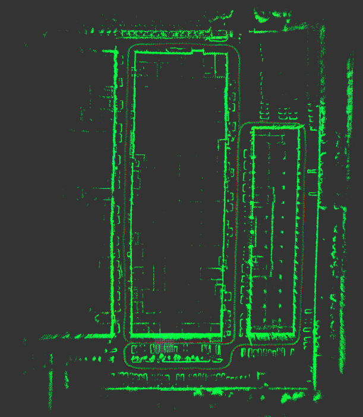

# LOL

Laser Odometry and Localization

## Introduction

Add localization support for LOAM/LeGO-LOAM, referenced from `8.2.3 Localization and Map Merging` in [1].

> Compared to the previous section, the difference is that the localization does not process individual scans but stacks a number of scans for batch processing. Thanks to the high-accuracy
odometry estimation, scans are registered precisely in a local coordinate frame where drift is
negligible over a short period of time (a few seconds).

Localization test(running at TX2) under point cloud map built by A-LeGO-LOAM[2].


Map bulit by lol using corner point cloud.



## Usage

### Input

- /surf: surf point cloud extracted by Laser Odometry
- /corner: corner point cloud extracted by Laser Odometry
- /outlier: outlier point cloud extracted by Image Projection
- /odom/lidar: odometry estimeted by Laser Odometry
- global map pcd file: built by A-LeGO-LOAM

### Output

- /tf: map -> odom
- /currenct_pose: PoseStamped
- ...

### Run the Package

1. Run the launch file:
```
roslaunch lol lol.launch
```

2. Play existing bag files [test_0515.bag](https://drive.google.com/file/d/1Y6KR9FUQggcyhvGsnkv7zpYQGvc7dQR_/view?usp=sharing):
```
rosbag play test_0515.bag --clock --topics /lslidar_point_cloud
```

## Reference

1. Zhang J. Online Lidar and Vision based Ego-motion Estimation and Mapping[D]. , 2015.
2. [https://github.com/jyakaranda/A-LeGO-LOAM](https://github.com/jyakaranda/A-LeGO-LOAM)
